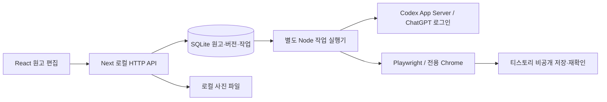

# auto_tstory

기존 글의 문체를 반영해 원고를 작성하고 티스토리에 전송하는 로컬 웹앱입니다. **원고 편집·사진 관리·비공개 전송**, **ChatGPT 로그인 기반 프로젝트·기술·PS·여행·정보·자유 초안 생성·블록별 재작성**, **대표 글 문체 분석·규칙 수정·생성 결과 비교**를 제공합니다. 네이버 블로그는 R1 조건부 자동화 실험까지 완료했으며 아직 웹앱의 정식 발행 기능은 아닙니다.

P0에서 실제 블로그의 `테스트` 카테고리에 비공개 글 1개를 저장하고, 제목·문단·목록·코드·표·이미지 2장·대표 이미지 보존을 확인했습니다. 비로그인 접근 차단과 브라우저 재시작 후 인증 재사용도 확인했습니다. P1 웹앱에서도 별도의 비공개 글 1개 저장과 본문·캡션·순서·대표 이미지 및 비로그인 접근 차단을 확인했습니다. P1의 두 번째 사진은 티스토리 검토 안내로 표시되어 최종 표시 확인을 대기 중입니다. 장기간 무인 운영과 다른 스킨·계정에서의 동작은 검증 범위에 포함되지 않습니다.

상세 계획과 최신 작업 기록: [PROJECT_PLAN.md](PROJECT_PLAN.md).

## 개발 목적과 코드 학습 자료

생성형 AI를 활용해 개인 블로그의 자료 정리·원고 작성·검토·비공개 전송을 돕는 프로젝트입니다. 실제 코드의 동작과 한계를 설명할 수 있도록 [기술 분석 보고서](docs/TECHNICAL_ANALYSIS_2026-09-23.md), [핵심 기술 학습·면접 자료](docs/LEARNING_GUIDE.md), [공개 전 검사 기록](docs/PUBLICATION_AUDIT_2026-09-23.md)을 제공합니다. 기존 외부 인수 기록과 이번 로컬 검사 결과를 구분합니다.

실제 사용 기술은 TypeScript, Next.js App Router/Route Handler, React Hooks, Node 내장 SQLite, Playwright, Codex App Server stdio, marked/sanitize-html, Cheerio, Sharp입니다. API 키 방식의 OpenAI SDK, Firebase, 별도 상태 관리 라이브러리, 결제·광고 SDK는 사용하지 않습니다.



`src/app/`은 화면·API, `src/lib/`는 원고 검증·저장·백업, `src/services/`는 AI·자료·블로그 어댑터, `scripts/`는 실행·설치·검사, `tests/`는 합성 회귀 검사입니다. 개인용 Windows 로컬 실행 환경이며 인터넷에 공개하는 서버 배포나 모바일 네이티브 앱은 제공하지 않습니다.

완료/일부/미구현의 상세 표는 기술 분석 보고서를 참고하세요. 네이버는 실험용 CLI 단계, Docker 코드 실행은 실제 컨테이너 검증 대기, 공개·예약 발행은 미구현입니다. 현재 알려진 문제는 전체 원고를 반복 조회하는 구조, AI 실행 중 다른 작업 대기, 사진 분석 적용의 두 저장 사이 오류 시 상태 불일치, 진단 자료 보존 정책 부재입니다. 이번 분석에서는 기능 코드를 수정하지 않았습니다. 개선 우선순위는 결과 적용의 원자성 → 조회량 측정·분리 → 작업 스케줄링·운영 검증입니다.

## 환경변수

기본 실행에 필수 비밀키는 없습니다. 설정 예시는 [.env.example](.env.example)에 있으며 값이 없는 주석 예제입니다. **파일을 복사하는 것만으로 실행기·worker 설정이 적용되지는 않습니다.** `scripts/run.mjs`와 worker는 `.env`를 자동으로 읽지 않으므로 필요한 값은 실행 전 부모 프로세스 환경변수로 지정하세요. Next만 별도로 읽는 설정과 혼동하지 마세요.

| 변수 | 기본값 / 용도 | 읽는 위치 |
| --- | --- | --- |
| `TSTORY_CODEX_BIN` | PATH의 `codex`; AI 실행 파일 경로 | `src/services/ai/codex.ts`, `scripts/environment.mjs` |
| `TSTORY_DATA_DIR` | 프로젝트의 `data`; DB·사진 | `src/lib/store.ts` |
| `TSTORY_BACKUP_DIR` | 프로젝트의 `backups`; 백업 명령 저장 위치 | `scripts/backup.ts` |
| `TSTORY_APP_ROOT` | 현재 작업 폴더; 고급 실행 설정 | `scripts/environment.mjs` |
| `TSTORY_RUNTIME_DIR` | `.local/runtime`; 실행 제어 파일·로그 | `scripts/environment.mjs` |
| `NEXT_TELEMETRY_DISABLED` | 선택적으로 `1` 지정; 설치·CI는 이미 지정 | `scripts/setup.mjs`, CI |

예: PowerShell에서 `$env:TSTORY_CODEX_BIN = 'C:/tools/codex.exe'` 후 `npm run dev`. 사용자 지정 자료 경로는 저장소 밖을 권장하며, 저장소 안에 두면 Git 제외와 빌드 추적 제외를 모두 추가해야 합니다. `TSTORY_INSTANCE_ID`는 실행기가 자동 생성합니다. API 키·비밀번호를 브라우저용 `NEXT_PUBLIC_*` 변수에 넣지 마세요.

## 화면·시연 자료를 넣을 위치

공개용 자료는 향후 `docs/demo/`에 **합성 원고로 새로 촬영하고 검토한 이미지/영상만** 추가하세요. 추천 장면은 블록 편집, AI 결과 검토, 중단 작업 재확인입니다. 현재 저장소에는 시연 이미지가 포함되어 있지 않으며 `.local/`의 기존 인증·진단 화면을 그대로 옮기지 않습니다.

## 공개 범위와 라이선스

소스 저장소는 공개되어 있지만 프로젝트 라이선스 파일은 없습니다. 기존 `package.json`의 `UNLICENSED`를 유지하며 새 라이선스는 추가하지 않았습니다. 직접 의존성의 실제 사용 위치·라이선스 메타데이터와 배포물 고지 검토 범위는 공개 전 검사 기록을 참고하세요. 사용자의 원고·사진·인증·DB·백업과 `node_modules`·빌드 산출물은 소스 업로드에 포함하지 않습니다.

다음 개발 방향: [2차 로드맵](ROADMAP_V2.md) — 사진·일반 글 합성 인수 완료, 다음은 네이버 정식 연결·공개 발행과 운영 안정화.

R1 연동 판정: [네이버·Gemini 검증 보고서](docs/R1_INTEGRATION_REPORT.md). 네이버는 비공개 사진 글의 저장·재열기에 성공해 조건부 지원 후보로 정했고, Gemini 소비자 로그인 연동은 공식 경로 변경과 약관 제한 때문에 보류했습니다.

데이터 백업·복원과 변경 전 검사 방법: [R0 회귀 검사와 복구 기준](REGRESSION_CHECKLIST.md).

## 로컬 웹앱 실행

Windows에서는 Node.js **22.20 이상인 22.x**를 설치하고 **`Install.cmd` → `Start.cmd`**를 실행합니다. 설치 폴더의 전체 경로는 영문·숫자 등 ASCII 문자여야 하며 공백은 허용합니다. 종료는 **원고 저장 후 `Stop.cmd`**, 환경 확인은 **`Doctor.cmd`**입니다. 설치·데이터 위치·오류 대응·지원 범위는 [Windows 설치 안내](docs/WINDOWS_SETUP.md)를 참고하세요.

Google Chrome은 블로그 연결·전송에, Codex는 AI 기능에 필요합니다. 둘 없이도 수동 원고 작성·저장을 사용할 수 있습니다. 첫 실행은 블로그 주소가 비어 있으며 본인의 주소를 설정합니다.

개발 실행:

```bash
npm ci --include=dev
npm run dev
```

브라우저에서 **http://127.0.0.1:3000**을 엽니다. 이 명령은 Next.js 서버와 별도 작업 실행기를 함께 시작합니다. 종료는 실행 터미널에서 `Ctrl+C`입니다. 강제로 중단한 직후 재실행하면 이전 잠금이 만료될 때까지 최대 16초 대기할 수 있습니다. P0 CLI와 웹앱 실행기로 같은 Chrome 프로필을 동시에 열지 마세요.

1. **블로그 연결**에서 주소를 저장하고 ‘로그인 확인 · 카테고리 새로고침’을 누릅니다.
2. 로그인이 필요하면 전용 Chrome에서 직접 로그인하고 **작업 내역 → 로그인 완료 · 재개**를 누릅니다.
3. **새 원고 작성**에서 유형·제목·요약·Markdown 본문·카테고리를 입력합니다.
4. 사진이나 폴더를 가져와 순서·설명·대표 이미지를 정합니다. 자주 쓰는 표지는 **표지 라이브러리**에 저장할 수 있습니다.
5. 원고를 저장하고 미리보기를 확인한 뒤 **비공개 전송 → 확인하고 전송**을 누릅니다. 전송은 새 비공개 글을 생성합니다.

본문과 사진은 블록 순서대로 배치합니다. **이 뒤에 본문 추가**, 블록 제목 드래그·위/아래 버튼, 사진 교체·제외·대표 선택을 지원합니다. 사진의 **작성 메모·묶음은 게시하지 않으며**, 짧은 캡션과 긴 본문 설명은 사진 위치에 맞춰 게시합니다. 기존 원고를 저장하면 새 블록 버전이 생기며 과거 버전과 전송 스냅샷은 보존합니다.

PNG·JPEG·WebP를 장당 10MB, 원고당 50장까지 받으며 실제 파일을 디코딩하고 메타데이터를 제거한 PNG로 보관합니다. 편집기에는 작은 WebP 썸네일을 사용합니다. 파일별 업로드 진행률과 실패 사진 개별 재시도를 제공하며 성공한 사진은 유지합니다. 요약은 생성 시 참고 자료로 사용하며 그대로 본문에 자동 삽입하지 않습니다. 50장은 로컬 편집 상한이고 50장 실제 전송 검증을 뜻하지 않습니다.

선택 사진은 묶음·개별 선택으로 한 번에 최대 10장 분석합니다. 사진 내용·모델·메모·묶음이 같으면 이전 결과를 재사용합니다. 캡션·긴 설명은 검토 후 적용하며 원고 버전이 달라지면 적용을 거절합니다. 전체 초안 생성도 사진 10장까지 지원합니다. 자세한 사용법과 전환/복구 규칙: [R2 사진 중심 편집](docs/R2_PHOTO_EDITING.md). 2026-09-23 실제 10장 비공개 저장·재열기·사진 표시·비로그인 차단을 통과했습니다.

여행·정보·자유 글은 유형별 자료를 입력하고 **개요·사진 배치 검토 완료 → 원고 저장 → 초안 생성**으로 진행합니다. 개요 제목·목적과 사진 위치를 직접 수정할 수 있습니다. **AI 수정 잠금**으로 블록을 보호하고, **재작성할 블록**에서 한 본문 또는 사진 설명만 바꿀 수 있습니다. ‘나의 문체’에서 블로그·유형별 기본 문체를 정하고 글마다 다른 문체를 고릅니다. [R3 작성 안내](docs/R3_WRITING.md).

새 세 유형은 사용자가 선택한 합성 자료로 실제 ChatGPT 생성·편집·비공개 저장·재열기·비로그인 차단까지 검증했습니다. 실제 사용자 여행 경험·정보 사실·새 문체의 품질 인수는 별도로 남아 있습니다.

원고·설정·작업은 `data/app.sqlite`, 사진은 `data/images/`, 로그인 상태와 진단 자료는 `.local/`에 저장됩니다. 모두 Git에서 제외됩니다. Node.js 22의 내장 SQLite는 실험적 기능 경고를 표시합니다. 웹 서버는 loopback에만 바인딩하며 변경 요청의 Origin과 전용 헤더를 검사합니다.

같은 원고 버전의 반복 요청은 같은 작업을 반환합니다. 저장 버튼을 누른 뒤 결과 확인이 끊기면 `저장 결과 확인 필요` 상태로 남기고 자동 재발행하지 않습니다. 진행 중·확인 필요 작업은 임의로 재시도하거나 DB에서 상태를 바꾸지 말고 티스토리 글 관리에서 확인하세요. 편집기에 다른 원고나 미완성 사진이 있으면 덮어쓰지 않고 중단합니다.

저장된 글 URL이 확인된 작업에는 **저장 결과 다시 확인** 버튼이 표시됩니다. 이 버튼은 기존 글만 검사하며 새 글을 만들지 않습니다. 티스토리의 사진 처리·검토가 끝나지 않았으면 확인 대기로 유지합니다. 대표 이미지 검사는 현재 블로그 스킨을 기준으로 합니다.

실행기가 중단되어 **저장 결과 확인 필요**가 된 작업도 주소가 있으면 같은 버튼으로 복구합니다. 주소가 없다면 작업 내역에서 **티스토리 글 관리**를 열어 전송 당시 글을 찾고, 관리/편집 주소가 아닌 글 주소를 **확인할 기존 글 주소 → 기존 글 연결 · 확인**에 입력하세요. 입력한 주소는 검사 후보로만 보관하며 제목·본문·카테고리·비공개 설정과 사진 검사가 통과해야 결과로 확정합니다. 다른 블로그·편집 주소·쿼리/해시가 있는 주소는 거절합니다. 재확인은 관리 화면에 나타난 페이지 링크를 최대 20쪽까지 읽으며, 글을 찾지 못하거나 현재 스킨을 해석하지 못하면 확인 대기로 남깁니다.

관리 목록과 검색 결과에도 글이 없다면 **관리 목록에 글이 없나요? → 미발행 확인 → 작업 종료**를 사용할 수 있습니다. 이는 사용자의 판단을 기록하는 절차이며 자동으로 미발행을 증명하거나 재전송하지 않습니다. 같은 버전은 종료된 작업을 유지합니다. 새 전송이 필요하면 원고를 저장해 새 버전을 만든 뒤 별도로 전송하세요. 이미 저장 주소가 확보된 작업은 미발행으로 종료할 수 없습니다.

새 PC의 `data/`가 없거나 비어 있어도 `npm run restore -- <백업 폴더> --confirm-replace-local-data`로 가져올 수 있습니다. 웹앱과 실행기를 먼저 종료하세요. 기존 DB가 있으면 안전 백업과 교체 전 폴더를 남기고, DB 없이 다른 파일이 들어 있는 폴더는 덮어쓰지 않습니다. 복원 보존·실패·임시 폴더의 사진도 Git에서 제외합니다. 사용자 지정 데이터/백업 위치는 별도로 Git 제외 여부를 확인하세요.

배포 설치의 명령형 경로는 `npm run setup` 후 `npm run launch`이며, `npm run stop`으로 종료합니다. 설치 과정에서 빌드 후 개발 의존성을 제거합니다. `npm start`는 배포 모드 전경 실행입니다. 외부 서버 배포·공개 발행·예약 발행은 현재 범위에 포함되지 않습니다.

## ChatGPT로 프로젝트 글 생성

Codex CLI가 설치되어 `codex --version`을 실행할 수 있어야 합니다. PATH에 없으면 웹앱 실행 전에 `TSTORY_CODEX_BIN` 환경변수에 `codex.exe`의 절대 경로를 지정하세요. 이번 구현은 Codex CLI 0.153.4로 검증했습니다.

1. 프로젝트 원고에 실제 구현 내용·배경을 요약으로 적고 사진을 첨부한 뒤 **원고 저장**을 누릅니다.
2. **ChatGPT 연결 · 새로고침 → ChatGPT로 로그인**에서 공식 로그인 화면을 엽니다. 로그인 완료 여부는 자동 확인합니다.
3. 계정에서 제공하는 모델을 선택하고 **요약·사진으로 초안 생성**을 누릅니다. 프로젝트 요약은 20자 이상 필요하며 사진이 있으면 사진 지원 모델을 사용합니다.
4. 생성된 개요·본문·캡션과 확인할 내용을 검토하고 **검토한 결과를 원고에 적용**을 누릅니다. 이후 미리보기와 직접 편집을 사용할 수 있습니다.
5. **선택한 구간만 다시 쓰기**에는 본문에 한 번만 등장하는 구간과 수정 요청을 입력합니다. 선택 구간 밖의 본문은 유지됩니다.
6. 수정한 원고를 저장한 뒤 별도의 **비공개 전송**으로 티스토리에 보냅니다. AI 생성만으로 발행하지 않습니다.

API 키 방식은 사용하지 않습니다. ChatGPT 로그인과 구독의 Codex 한도를 사용하며 다른 Codex 작업과 한도를 공유할 수 있습니다. 생성 직전 반환된 한도가 소진되었거나 확인되지 않으면 생성을 중단하고 추가 결제나 크레딧 구매를 요청하지 않습니다. 토큰 사용량은 반환된 수치이며 청구 금액을 뜻하지 않습니다.

인증은 `.local/codex-writing/`의 앱 전용 Codex 저장소에서 관리합니다. 기존 개발용 Codex 설정·인증을 복사하지 않습니다. 로그인 정보와 원고는 Git에서 제외되며 생성 버튼을 누르면 해당 원고의 요약·본문·사진이 OpenAI로 전송됩니다. 공식 App Server의 stdio 프로토콜을 사용하고 쉘·브라우저·플러그인 등 불필요한 기능을 비활성화합니다. App Server는 실험적 인터페이스이므로 CLI 업데이트 시 호환성을 확인해야 합니다.

원고 저장 버전과 생성 결과를 별도로 보관합니다. 생성 후 원고가 변경되면 자동 적용을 거절하고 결과를 복사할 수 있게 합니다. 앱은 자동 재시도하지 않으며 실패한 작업은 한 번만 수동 재시도할 수 있습니다. 생성 대기는 최대 5분이고 진행 중 취소를 지원합니다. Codex 내부의 네트워크 복구 횟수까지 앱의 시도 횟수와 동일하다고 보장하지 않습니다. 취소하더라도 이미 사용한 한도는 반환되지 않을 수 있습니다.

P2 실제 검증: ChatGPT Plus에서 합성 사진을 읽어 초안·캡션 생성, 부분 재작성, 검토 적용과 수동 편집, `테스트` 카테고리 비공개 글 1개 저장 및 재열기·사진·대표 이미지 확인 성공. 기술·PS 전용 입력과 생성은 아래 P4 사용법을 참고하세요.

## 기술·PS 글 생성

1. 새 원고의 **글 유형**을 기술 또는 PS로 선택합니다. 기술은 주제와 설명 범위(요약 20자 이상), PS는 문제 본문·제약 조건·언어를 입력합니다. 본인 해석이나 접근 과정도 따로 적을 수 있습니다.
2. **참고 URL 가져오기 · 본문 붙여넣기**에서 자료를 보관한 뒤 사용할 자료를 최대 5개 선택합니다. 자동 가져오기는 화면에 안내한 공식 문서·문제 사이트만 지원하며, 접근 실패 시 본문을 붙여넣습니다. 자료당 80~20,000자입니다.
3. 공식 도메인 접근 확인과 붙여넣기 자료를 구분해 표시합니다. 접근 성공은 사실 검증 완료가 아닙니다. 생성 버튼을 누르면 선택한 자료 본문, 문제·코드·예제도 ChatGPT에 전송되며 요청 당시 내용이 고정됩니다.
4. **원고 저장 → 기술 글 초안 생성 / PS 해설 초안 생성 → 검토한 결과를 원고에 적용** 순서로 사용합니다. 기술 글의 출처·버전·사용자 해석, PS 해설의 정당성·복잡도·예제 추적을 검토하세요. AI가 작성한 설명을 실행 결과로 취급하지 않습니다.
5. PS의 **검토·실행할 코드**는 본문과 별도로 저장합니다. 본문의 Python 코드 블록이 하나이고 입력란이 비어 있으면 가져올 수 있습니다. 예제와 경계 사례를 최대 5개 입력하고 저장한 뒤 **저장한 Python 코드 예제 검증**을 누릅니다.
6. 코드는 Docker 안에서만 실행합니다. Docker가 없거나 로컬 `python:3.12-slim` 이미지가 없으면 **미실행**으로 종료하며 호스트 실행으로 전환하지 않습니다. 환경을 직접 준비할 때 Docker를 시작하고 `docker pull python:3.12-slim`으로 이미지를 받으세요. 앱은 설치·이미지 다운로드를 자동 수행하지 않습니다.
7. 실행은 네트워크 차단, 읽기 전용 파일 시스템, 비루트 사용자, 호스트 폴더 마운트 없음, 128MiB 메모리·CPU·프로세스·출력·시간 제한을 사용합니다. 비교는 줄바꿈 형식과 출력 끝 공백을 정규화하며 입력한 사례만 확인합니다. 원고가 바뀌면 이전 검증 결과를 현재 버전의 결과로 표시하지 않습니다. 온라인 저지 정답 판정은 제공하지 않습니다.
8. 검토 후 **비공개 전송**을 사용합니다. 코드 블록·표와 `O(N)` 같은 일반 텍스트 수식을 지원합니다. LaTeX 렌더링은 지원하지 않습니다.

P4 실제 확인: 기술·PS 각각 ChatGPT 생성, 원고 적용, 코드·표 미리보기와 모바일 표시, 비공개 저장·재열기 확인. Docker가 설치되지 않은 환경의 미실행 표시는 확인했으나, 컨테이너에서 예제·경계 사례를 실제 실행하는 검증은 남아 있습니다. 해설 생성은 언어를 자유롭게 입력할 수 있고 실행 어댑터는 Python만 지원합니다. 별도 API 결제 공급자는 추가하지 않았습니다.

검사: `npx tsx scripts/web-content-check.ts`는 로컬 테스트 원고를 만들고 입력·화면·검증 요청을 검사합니다. `--generate`를 추가하면 공식 자료 접근과 실제 ChatGPT 생성 2회를 수행해 구독 한도를 사용합니다. 이 스크립트는 티스토리에 발행하지 않습니다.

## 나의 문체 사용

1. **나의 문체**에서 현재 연결한 티스토리 블로그의 개별 공개 글 URL을 입력하고 **공개 글 본문 가져오기**를 누릅니다. 비공개 글·다른 스킨 등으로 가져오지 못하면 본문을 직접 붙여넣으세요.
2. 추출된 제목·본문을 확인하고 공통/프로젝트/기술/PS 유형을 지정한 뒤 **대표 글 저장**을 누릅니다. 메뉴·광고·댓글이 섞이지 않았는지 확인할 수 있습니다.
3. 대표 글 1~20개를 선택하고 ChatGPT 연결·모델·문체 이름·유형을 정해 분석합니다. 긴 글은 앞과 뒤를 발췌해 글당 최대 약 6천 자, 전체 약 4만 자로 분석합니다.
4. 분석 근거와 한계를 읽고 **분석 규칙 검토**에서 규칙을 수정한 뒤 **문체 확정 저장**을 누릅니다. 기존 문체를 고쳐 저장하면 새 버전이 생성됩니다.
5. 원고 생성 화면의 **적용할 문체**에서 확정한 문체를 선택합니다. 공통 문체 또는 원고 유형과 일치하는 문체를 사용할 수 있습니다. 생성 요청에는 규칙 버전과 최대 3개 예시 발췌가 고정됩니다.
6. 같은 원고 버전에서 기본 문체와 내 문체로 각각 생성한 뒤 **생성 결과 나란히 비교**로 확인하세요. 비교에는 생성 요청 두 번의 구독 사용량이 발생하며, 별도의 문체 일치율은 계산하지 않습니다.

문체 자료는 말투·구조 참고용이며 원문의 사실·경험을 새 글에 옮기는 자료가 아닙니다. 생성 결과와 수동 수정본이 자동으로 대표 글에 편입되지 않습니다. 반영하고 싶다면 **직접 수정한 원고를 대표 글로 가져오기**에서 선택·검토·저장하고 다시 분석하세요.

대표 글, 문체 버전, 분석 결과는 Git에서 제외되는 로컬 SQLite에 저장합니다. 대표 글을 목록에서 제외하거나 수정해도 이미 확정한 문체와 기존 작업의 참조 사본은 유지합니다. 문체 분석에도 기존 ChatGPT 구독 한도, 취소·실패당 한 번 재시도·5분 제한이 적용됩니다. 문체 설정은 발행을 실행하지 않습니다.

공식 참고: [App Server](https://learn.chatgpt.com/docs/app-server), [ChatGPT 로그인](https://learn.chatgpt.com/docs/auth).

## 웹앱 검증 명령

`npx tsx scripts/web-ai-check.ts --generate`는 별도로 선택한 실제 AI 검사입니다. ChatGPT 구독 한도를 사용하고 로컬 합성 테스트 원고를 생성하지만 티스토리에는 발행하지 않습니다. 일반 회귀 검사에 포함하지 않습니다.

```bash
npm run typecheck
npm test
npm run build
npm run test:build-artifacts
```

R0.1 복구 UI와 읽기 전용 검사는 빌드 후 `npx tsx scripts/web-recovery-check.ts`로 실행합니다. 3000 포트가 비어 있어야 하며, 별도 합성 DB와 요청을 가로챈 모의 티스토리 화면을 사용합니다. 실제 계정·AI·블로그 발행은 사용하지 않습니다.

R2는 빌드 후 `npm run test:blocks`로 합성 50장 업로드·재시도, 10장 본문 교차 미리보기, 순서 변경·교체·버전 보존·모바일 표시를 검사합니다. 별도 DB를 사용하며 외부 계정에 접속하지 않습니다. `scripts/r2-private-check.ts --private-test`는 별도 선택한 실제 비공개 전송 검사이므로 기본 회귀에 포함하지 않습니다.

R7.1 최초 설치 검사는 `npm run test:installation -- --install`입니다. 별도 영문·공백 경로에 소스만 복사하고 실제 npm 설치·빌드·개발 의존성 제거 뒤 초기 설정·원고 저장·재시작·중복 실행·정상 종료·실행기 오류·포트 충돌을 검사합니다. 현재 한글 등 비ASCII 설치 경로는 런타임 호환성 문제로 설치 전에 거절합니다. 실제 계정·원고·인증 자료는 사용하지 않습니다. Chrome 없이 API로 검사하려면 `--no-browser`를 추가합니다. Windows CI는 타입·단위·빌드와 이 API 설치 검사를 정의하며 실제 외부 계정 검사는 분리합니다.

실행 중인 로컬 앱에 대해 `npm run p0:fixtures`로 합성 사진을 준비한 뒤 `npm run test:web`, `npx tsx scripts/web-assets-check.ts`를 실행할 수 있습니다. 테스트는 로컬 테스트 원고와 사진을 생성합니다. 기본 실행은 티스토리 글을 저장하지 않습니다. `test:web -- --connect`는 블로그 연결 작업까지 요청합니다. `scripts/web-publish-check.ts --private-test`는 별도로 준비된 유일한 P1 합성 테스트 원고를 실제로 비공개 전송하므로 일반 회귀 검사에 포함하지 않습니다.

## P0 실행

Node.js 22.20 이상인 22.x와 Google Chrome이 필요합니다. 개발 검사 준비:

```bash
npm ci
npm run typecheck
npm test
npm run test:browser
```

`test:browser`는 임시 로컬 웹페이지와 별도 테스트 프로필에서 한글 입력, 쿠키·로컬 저장소 재사용, PNG 두 장 선택을 확인합니다. 티스토리에 접속하거나 글을 저장하지 않습니다. 검사 자료는 `.local/smoke-profile-*/`에 격리하며 실제 티스토리 검증 원고·검사 기록을 덮어쓰지 않습니다.

실제 티스토리 검증용 원고와 PNG 두 장은 `npm run p0:fixtures`로 준비합니다. 기존 테스트 원고 식별자는 유지합니다.

로그인 브라우저 실행:

```bash
npm run p0 -- --blog https://블로그이름.tistory.com
```

주소를 생략하면 티스토리 로그인 화면부터 열립니다. 평소 사용하는 Chrome과 별도의 `.local/tistory-profile/`을 사용합니다. 로그인·추가 인증은 열린 브라우저에서 직접 처리하고, 비밀번호나 인증번호를 터미널에 입력하지 마세요.

| 터미널 명령 | 동작 |
| --- | --- |
| `status` | 현재 탭의 주소 확인. 인증 쿼리·해시는 출력하지 않음 |
| `blog https://이름.tistory.com` | 검증할 블로그의 관리 화면으로 이동 |
| `checkpoint` | 로그인된 관리 홈에서 인증 상태를 `.local/`에 저장 |
| `inspect` | 선택한 블로그 화면의 본문·컨트롤 구조 검사 |
| `editor` | 관리 화면의 글쓰기 링크 열기 |
| `screenshot` | 선택한 블로그 화면을 `.local/last-page.png`에 저장 |
| `restart` | 전용 브라우저를 정상 종료·재실행해 관리 화면 접근 확인 |
| `quit` | 전용 브라우저와 도구 종료 |

로그인 완료 후 관리 홈에서 `checkpoint`를 실행하세요. 프로필에 남지 않는 세션 쿠키도 `.local/tistory-auth.json`에 저장하고 다음 실행에 복원합니다. `restart`는 관리 홈에서 인증 상태를 저장한 뒤 재시작합니다. 서버가 만료·취소한 세션은 복원 파일이 있어도 다시 로그인해야 합니다.

브라우저 재시작은 작성 중 내용을 잃을 수 있으므로 편집 중에는 실행하지 마세요. 인증된 관리·편집 화면에서는 갱신된 쿠키를 주기적으로 저장합니다. 이 파일은 암호화된 비밀 저장소가 아니며 현재 PC의 사용자 파일 권한으로 보호됩니다.

## 에디터 검증 명령

아래 명령은 `npm run p0`로 실행한 터미널에 한 줄씩 입력합니다. 각 단계의 결과와 화면을 확인한 뒤 다음 단계로 진행하세요. **`action save-private <카테고리>`는 실제 티스토리에 비공개 글을 저장합니다.**

| 순서 | 명령 | 동작 |
| --- | --- | --- |
| 1 | `editor` | 관리 홈에서 새 글 열기 |
| 2 | `action category-menu` | 카테고리 목록 표시 |
| 3 | `action category-select 테스트` | 정확한 이름으로 카테고리 선택 |
| 4 | `action mode-html` | HTML 모드로 전환 |
| 5 | `action fill-fixture` | 빈 원고에 고정 테스트 제목과 HTML 입력 |
| 6 | `action attach-menu` | 첨부 메뉴 열기 |
| 7 | `action upload-fixtures` | 테스트 PNG 두 장 첨부 |
| 8 | `inspect` | 업로드 완료와 본문의 이미지 마커 2개 확인 (`.local/last-inspection.json`) |
| 9 | `action mode-basic` | 기본모드로 전환 |
| 10 | `action image-one-select` | 본문의 첫 이미지 선택 |
| 11 | `action representative-select` | 선택한 이미지를 대표로 지정 |
| 12 | `action publish-options` | 발행 설정 열기, 실제 저장은 하지 않음 |
| 13 | `action cover-state` | 대표 이미지와 비공개 선택 상태 확인 |
| 14 | `action save-private 테스트` | 제목·본문·이미지·카테고리·비공개 설정 확인 후 저장 |
| 15 | `action open-saved` | 관리 목록에서 저장 결과를 확인하고 글 열기 |
| 16 | `action verify-saved` | 저장된 내용과 대표 이미지 확인, 로컬 결과 기록 |

P0는 비공개가 선택되어 있지 않으면 저장을 거부합니다. 같은 원고의 저장 시도가 기록되어 있으면 다시 입력·저장하지 않으므로, 시간 초과가 발생해도 먼저 관리 목록을 확인하세요. 공개 발행 기능은 제공하지 않습니다.

현재 생성된 테스트 글은 다시 만들 필요가 없습니다. 관리 홈에서 `action post-list` → `action open-saved` → `action verify-saved`로 재확인할 수 있습니다.

보조 명령: `action preview`, `action preview-verify`, `action preview-close`, `action body-inspect`, `action anonymous-check`, `action session-check`, `action back-to-manager`. 자동 저장 복구 확인창에서는 `action dialog-info`로 내용을 확인하고, 이 도구의 테스트 원고라면 `action restore-fixture`로 복구합니다. 다른 확인창은 자동 승인하지 않습니다.

대표 이미지는 기본모드에서 본문 이미지를 선택하는 방법을 사용합니다. 별도 대표 이미지 파일 업로드는 검증 중 문제가 있어 최종 명령에서 제외했습니다. 저장 결과의 대표 이미지 확인에는 현재 블로그 스킨의 `.article-header`도 사용하므로 다른 스킨에서는 검증 어댑터를 조정해야 할 수 있습니다.

## 로컬 자료와 Git

`.env*`, `.local/`, `data/`, DB, 로그, 테스트 보고서는 Git에서 제외합니다. 화면 검사 결과에는 블로그 본문이 포함될 수 있으므로 `.local/`에만 저장합니다. 별도로 만든 파일을 커밋할 때도 내용을 확인하세요.

```bash
git status
git add README.md src scripts tests package.json package-lock.json tsconfig.json PROJECT_PLAN.md
git diff --cached
git commit -m "변경 내용"
git push
```

### 게시 중복 방지·장애 복구 검증

[검증 보고서](BLOG_PUBLISH_RECOVERY_VALIDATION.md)와 [익명 결과 JSON](measurements/blog-publish-recovery-20260923.json)에 자동 30회와 실제 비공개 E1~E3 결과를 분리했다. 실제 검사 최초 E3의 포트 오류 1회도 보존했다. 현재는 요청 억제·자동 재발행 차단·기존 글 재확인을 검증한 것이며 외부 저장 exactly-once 보장은 아니다.
