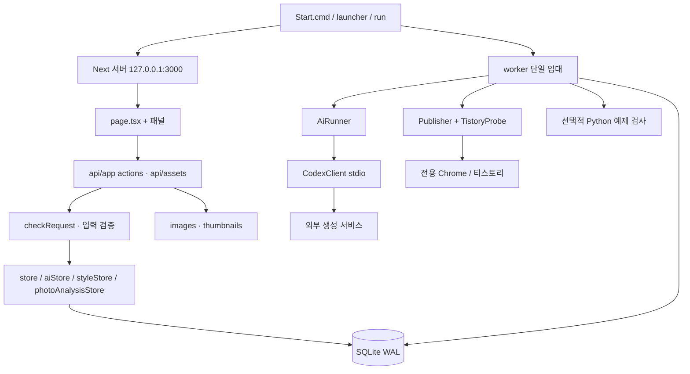

# 블로그 자동 글쓰기 — 기술 분석 보고서

검토일: 2026-09-23. 기준: 시작 HEAD `f460832` 이후 작업 트리의 R0.1/R7.1/R2/R3 코드. **이번 변경은 공개 준비·분석 문서이며 기능 개선 구현이 아니다.** 근거는 아래 파일/함수 및 재현 결과다. 파일 링크는 이 문서 기준 상대 경로다. 최신 이력은 [PROJECT_PLAN](../PROJECT_PLAN.md), 학습 자료는 [LEARNING_GUIDE](LEARNING_GUIDE.md).

판정 용어: **구현**은 UI/API/호출 경로가 연결됨, **로컬 검증**은 합성 데이터 검사 통과, **이력 확인**은 기존 작업 기록에 외부 인수 결과가 있음, **미검증**은 이번 또는 기존 증거가 부족함. 코드 존재와 실제 외부 서비스 성공을 구분한다.

## 1. 프로젝트 요약

한 사람이 자신의 Windows PC에서 사진·메모·자료를 원고로 편집하고, ChatGPT 로그인 기반 Codex로 초안을 생성·검토한 뒤 티스토리에 **비공개 글**을 저장하는 로컬 웹앱이다. 여섯 글 유형, 문체 규칙, 블록 편집, 버전 보존, SQLite 작업 큐, 저장 후 재확인을 구현했다. 구독 연결은 구현상 정책이며 사용 가능한 모델은 계정의 `model/list` 응답에서 선택한다. 고정된 특정 모델만 쓰는 프로젝트가 아니다.

프로덕션 SaaS, 공식 티스토리 API 클라이언트, 무인 대량 공개 발행 서비스는 아니다. 사용자 입력→AI 출력→검토 적용→전송을 분리한 점과 외부 저장 결과가 불명확할 때 재발행을 멈추는 점이 기술적으로 의미 있다.

## 2. GitHub 공개 여부와 주소

기존 저장소: [Jinxxlog/auto_tstory](https://github.com/Jinxxlog/auto_tstory). GitHub API에서 공개 상태를 확인했고 기존 remote main과 로컬 시작 HEAD가 같았다. 미커밋 구현을 포함한 공개 대상은 검사 후 업로드하며 최종 커밋/업로드 결과는 PROJECT_PLAN 이번 작업 기록을 따른다. 라이선스 파일은 없고 `package.json`의 `UNLICENSED`를 유지했다. 라이선스 신규 선택 및 기록 재작성 없음.

## 3. 비밀정보 검사 결과

공개 후보와 도달 가능한 과거 13개 커밋/138개 고유 blob에서 검사 패턴상 비밀값 미탐지. `.local/`에는 실제 세션·AI/Gemini OAuth 인증과 JWT가 포함된 Codex 내부 로그가 있어 공개에서 제외했다. `data/`·`backups/`는 원고와 사진이므로 역시 제외했다. 새 `.env.example`은 실제 비밀값이 없고 현재 구현의 환경변수 읽기 위치를 설명한다. [검사 범위·민감 경로·재배포 검토·한계](PUBLICATION_AUDIT_2026-09-23.md)를 참조한다.

## 4. 주요 기능과 실제 호출 흐름

| 기능 | 사용자 관점 설명 | 주요 처리 과정 | 근거 파일·함수 | 완성 상태 |
| --- | --- | --- | --- | --- |
| 원고 작성·저장·재편집 | 여섯 유형의 제목·메모·본문을 보존 | 입력→검증→트랜잭션→현재본/버전 저장 | [page.tsx](../src/app/page.tsx) `api`, [store.ts](../src/lib/store.ts) `validateDraft/saveDraft` | 구현·이번 단위/UI 통과 |
| 본문/사진 블록 | 사진을 문단 사이에 배치, 캡션·메모 분리 | block ID/이미지 참조 검증→Markdown/images 파생→렌더 | [blocks.ts](../src/lib/blocks.ts), `BlockEditor`, `renderDraft` | 구현·이번 단위 통과; 50장 UI는 기존 기록 |
| 파일/폴더·표지 | 사진 가져오기·대표/라이브러리 선택 | 순차 업로드→디코드→PNG/해시→DB→썸네일 | `page.tsx` 업로드 루프, [assets.ts](../src/lib/assets.ts) `importImage/thumbnail` | 구현; 최대 50장 편집, AI 10장 제한 |
| AI 초안·구간/블록 재작성 | 사용자가 지정한 범위의 글 생성 | 큐→stdio→JSON 구조 검증→검토→버전 일치 적용 | `AiPanel`, `aiStore.enqueue/apply`, `CodexClient.generate`, `parseOutput` | 구현·이번 모의 UI 통과; 실제 생성은 기존 P2/P4/R3 기록 |
| 개요·AI 잠금 | 새 유형은 개요 검토 후 생성, 잠근 블록 보존 | 로컬 개요→검토 토큰→저장→생성 요구 검사 | `OutlinePanel`, [writing.ts](../src/lib/writing.ts) `outlineReviewed/generationMaterial` | 구현; 개요 생성은 LLM 호출 아님 |
| 문체 분석·버전·비교 | 대표 글의 말투를 참고해 생성 | URL/붙여넣기→분석→규칙 확정→스냅샷→비교 | `StylePanel`, `styleStore`, `analysisPrompt/snapshot` | 구현; 실제 3편 분석 이력, 자동 학습/일치율 없음 |
| 출처 가져오기 | 공식 자료와 붙여넣기를 구분 | 허용 HTTPS 호스트→제한 fetch→Cheerio→DB | [references.ts](../src/services/references.ts) `fetchReference/referenceStore`, `MaterialPanel` | 구현; 접근 성공과 사실 대조는 별개 |
| 선택 사진 분석·캐시 | 사진 설명 제안을 검토·적용 | 이미지 SHA-256+조건 키→캐시/AI→결과→버전 검사 | [photo-analysis.ts](../src/lib/photo-analysis.ts) `enqueue/finish/apply` | 구현·캐시 단위 통과; 실제 AI 캐시 인수는 미검증, 적용 원자성 결함 확인 |
| 티스토리 연결·전송 | 직접 로그인 후 비공개 글 저장 | 카테고리→스냅샷→Chrome 편집→저장→재열기 | `JobCard`, `store.enqueue`, [publisher.ts](../src/services/tistory/publisher.ts) `Publisher.publish/verify`, `TistoryProbe` | 구현; 기존 R2 10장/R3 3유형 실제 비공개 인수 기록. 이번 외부 재실행 없음 |
| 중단 복구 | 새 글 생성 없이 기존 결과 확인 | 임대 만료→unknown/attention→기존 URL 후보→읽기 검사 | `store.acquire/verify/resolveUnpublished`, `scripts/worker.ts` | 구현·이번 회귀 통과; 미발행 종료는 사용자 판단 |
| 백업·복원·감사 | 로컬 원고/사진 보존·복구 | SQLite online backup→인증 상태 정규화→이미지 해시→검증→교체/복귀 | [backup.ts](../src/lib/backup.ts) `createBackup/verifyBackup/restoreBackup`, `auditData` | CLI 구현·이번 통합 성격 단위 통과 |
| 설치·진단·실행/종료 | cmd 파일로 로컬 앱 실행 | 환경 검사→빌드/prune→웹 준비→worker→인증된 종료 | `Install/Start/Stop/Doctor.cmd`, `scripts/run.mjs/setup.mjs` | 구현; 새 설치는 기존 같은 PC 격리 기록, 타 PC 미검증 |
| PS 코드 검사 | 저장한 Python과 입력 예제 비교 | 큐→Docker 존재 확인→격리 실행→출력 비교 | [code-check.ts](../src/services/code-check.ts) `dockerArgs/runCodeCheck` | UI/실행 경로 존재; 실제 컨테이너 미검증 |
| 네이버 | 별도 실험 CLI로 비공개 입력 검증 | `scripts/r1-naver.ts`→Naver probe | [naver/probe.ts](../src/services/naver/probe.ts) | CLI에서 사용 중, 웹앱 worker에는 미연결; 제품화 R5 |
| Gemini·공개/예약·다중 사용자 | 후속 확장 | 로드맵만 존재 | `ROADMAP_V2.md`; `BlogTarget.visibility`는 private만 허용 | 미구현/보류. Gemini 런타임 공급자 없음 |

### 기능별 7단계 데이터 흐름

아래 각 행은 **입력→화면/API→로직→외부 호출→저장/조회→화면 반영→오류 처리** 순서다. HTTP는 `/api/app`의 action을 사용하는 RPC에 가까우며, URL마다 자원을 나누는 엄격한 REST 설계로 부르지 않는다.

| 흐름 | 입력·화면/API | 비즈니스 로직·외부 요청 | 저장·조회·화면 반영 | 오류 처리 |
| --- | --- | --- | --- | --- |
| 수동 편집 | `page.tsx` state→`POST save/preview/versions` | `validateDraft`, block 참조·길이·유형 검사; 외부 없음 | `documents`, `draft_versions`; 응답을 편집 state/미리보기에 반영 | 버전 충돌/없는 사진은 저장 거절, 메시지 표시 |
| 사진 | file chooser/폴더→`POST /api/assets` | 실제 MIME·픽셀·크기 검사, Sharp 재인코딩; 외부 없음 | `images/{id}.png`, `assets`; 썸네일 GET/편집 블록 반영 | 장당 실패 안내·개별 재시도; DB 등록 실패 후 고아 파일 가능 |
| 초안/재작성 | 저장된 원고·모델·범위→`ai-generate` | `aiStore.enqueue` 스냅샷→`AiRunner.tick`→`CodexClient.complete`; 계정/모델/한도 후 thread/turn | `ai_jobs` output/usage; 폴링으로 결과 표시, `ai-apply`가 새 버전 | 5분 제한, 취소, 수동 재시도 1회, stale 결과 적용 거절 |
| 문체 | URL/붙여넣기→`style-import/source-save/analyze` | `importPost` 익명 fetch, 본문 정제; `analyze`가 AI 호출 | `style_sources/jobs/profiles/defaults`; 규칙 검토·비교 패널 | 호스트/본문 영역/길이 실패는 붙여넣기, 확정 버전 충돌 거절 |
| 자료 | URL·전문→`reference-fetch/paste` | `referenceUrl`+15초/2MB 제한 fetch, `extractReference` | `reference_sources`; 선택 ID를 생성 시 참조 사본으로 고정 | 외부 도메인·리디렉션·큰 응답 거절; 붙여넣기 사실성은 사용자 검토 |
| 사진 분석 | 사진 ID 1~10개·모델→`photo-analyze` | 각 파일 해시→캐시 조회→miss만 AI 분석 | `photo_jobs/photo_cache`; 제안 표시 후 `photo-apply` | 버전 변경/취소 방어; 두 저장의 원자성 문제는 아래 P1 |
| 개요 | 유형별 메모·사진 순서→로컬 개요 버튼→`save` | `validateWriting/validateOutline`, 검토 토큰 비교; 외부 없음 | 원고 JSON의 writing/outline/reviewedOutline; 생성 버튼 활성화 | 자료 변경 시 검토 만료·재검토 요구 |
| 블로그 | 주소·카테고리·전송 확인→`settings/connect/publish` | `enqueue` dedupe→worker `claim`→Playwright 순차 입력/업로드 | `jobs` snapshot/step/result; 2.5초 조회로 진행 표시 | LoginRequired→직접 로그인; 저장 요청 뒤 불명확→unknown, 자동 재발행 없음 |
| 재확인 | 작업 ID·후보 URL→`verify` | 주소/블로그 검사→`Publisher.verify`가 기존 목록/글 읽기 | 동일 jobs ID에 후보와 확정 URL 분리; 통과 때 succeeded | 다른 글·공개·본문/사진 불일치면 attention; 글을 자동 수정하지 않음 |
| PS | 저장된 코드/예제→`code-check` | worker→Docker image inspect→사례별 제한 컨테이너 | `code_checks` 실제 출력·일치 결과; 자료 패널 표시 | 환경 없음 unavailable; 시간/출력 초과 failed; 호스트 실행 대체 없음 |
| 백업/복원 | CLI 경로·교체 플래그→`scripts/backup.ts` | 활성 작업 검사·온라인 백업·hash·경로 검사; 외부 없음 | manifest/DB/images; CLI 검증 집계, 복원 후 앱이 읽음 | 손상 거절, 교체 실패 시 이전 폴더 보존/복귀 |
| 실행/종료 | cmd/CLI→launcher→run | 환경/포트→웹 health instance→worker IPC; 로컬 HTTP 제어 | `.local/runtime` token/state; 브라우저 열기·상태 메시지 | 타 프로세스 종료 금지, 자식 종료/임대 해제, 실패 메시지 |

## 5. 기술 스택과 사용 근거

버전은 이번 `package.json`/설치 상태 기준이며 일반적인 최신 권장 버전 주장이 아니다.

| 기술 | 사용 위치 | 해결한 문제 | 실제 사용 근거 | 이해할 개념 | 개선 가능성 |
| --- | --- | --- | --- | --- | --- |
| TypeScript 7.0.2 | src, scripts, tests | 원고/작업 계약 표현 | `Draft/Job/AiJob`, `tsc --noEmit` 통과 | 정적 타입 vs 런타임 검증 | 상태 union 강화, any 축소 |
| Next 16.3.4 App Router | app/layout, page, api | UI와 로컬 HTTP 서비스 | next build/start, GET/POST exports | client/server 경계, Node runtime | `/api/app` action 분리·요약 endpoint |
| React/React DOM 19.2.8 | 페이지·패널, Next renderer | 편집 state와 결과 표시 | useState/useEffect/useCallback; Next 통한 React DOM 간접 사용 | controlled input, effect cleanup, state 갱신 | 폴링 취소/숨긴 탭 감속, hooks 분리 |
| Node 22.20+ 22.x | scripts/run, worker | 장기 작업·프로세스 제어 | spawn/IPC/timer/fs/crypto | event loop, AbortSignal, 프로세스 수명 | 작업 클래스별 공정한 스케줄링 |
| 내장 node:sqlite | store, backup | 로컬 영속성·큐·버전 | DatabaseSync/prepare/transaction/backup | WAL, 트랜잭션, unique, 임대, 낙관적 잠금 | JSON 상태 열 분리, LIMIT/인덱스 |
| Playwright 1.63.0 | TistoryProbe/Publisher, NaverProbe, UI 검사 | 웹 편집기 파일·로그인 조작 | launchPersistentContext, locator, filechooser | locator/iframe/영속 context, 대기 | 스킨별 어댑터/외부 인수 계약 |
| Codex App Server | `CodexClient` | ChatGPT 로그인으로 구조화 생성 | spawn app-server, initialize, account/read, model/list, thread/start, turn/start | stdio 메시지 ID·알림·구조화 출력·취소 | 공급자 계약에 analyze/photos 포함·호환성 테스트 |
| marked 18.0.12 | content.renderMarkdown | Markdown→HTML | marked.parse | GFM·코드·표 | 변환 계약 회귀 유지 |
| sanitize-html 2.17.7 | 같은 함수 | 실행 가능한 HTML/원격 이미지 제거 | allowedTags/Attributes/Schemes | XSS와 escaping 차이 | 임의 제거 금지, CSP 보완 검토 |
| Cheerio 1.2.0 | references, style/import, Publisher.verify | HTML에서 본문 추출/비교 | load, 선택자, text | DOM parsing은 JS 실행 아님 | 스킨 fixture·추출 규칙 분리 |
| Sharp 0.35.4 | assets, publisher | 이미지 검증·메타정보 제거·thumbnail | sharp.metadata/rotate/png/resize/webp | 입력 픽셀 제한·압축 크기·EXIF | 고해상도 메모리 계측·보존 정책 |
| tsx 4.23.13 | scripts, tests, worker | TS를 Node에서 실행 | npm scripts, run.mjs `--import tsx` | 실행 의존성/개발 의존성 차이 | worker 사전 컴파일은 선택사항 |
| node:test/assert | tests | 회귀 방어 | tsx --test, assert | 단위/통합/계약 테스트 차이 | 원자성·공급자 실패 테스트 보강 |
| Docker CLI | code-check | 사용자/AI Python 코드 격리 | spawn('docker',args) | 컨테이너 제한과 호스트 보호 | 실제 Docker 인수 후 지원 확정 |
| GitHub Actions·npm lockfile | .github/workflows/ci.yml | Windows 검사 자동화 정의 | push/PR→typecheck/test/build/install check | CI와 배포 차이 | 원격 성공 확인, UI 작업 추가, action SHA 고정 검토 |

**핵심**: React/Next, TS/Node, SQLite 큐·버전, Playwright, Codex 계약. **보조**: Markdown/정제, Cheerio/Sharp, 설치·백업·검사 도구. 선언된 직접 패키지에서 사용 근거가 전혀 없는 항목은 발견하지 못했다. React DOM은 Next를 통한 간접 사용이며 미사용으로 제거하면 안 된다. @types는 타입 검사에만 쓰인다. `npm ls`의 extraneous 2개는 Sharp 설치 잔여/선택 의존성 성격으로, 원인 확인 전 직접 패키지로 소개하거나 제거하지 않는다.

별도 Redux/Zustand·ORM·Firebase·Redis·WebSocket/SSE·광고·결제·모바일 SDK는 없다. 실시간 동기화는 서버 push가 아니라 HTTP 폴링이다. 브라우저 localStorage가 원고 저장소인 구조도 아니다. Gemini는 조사 기록만 있고 실행 공급자 코드가 없다. 코드 작성 주체가 AI인지 사람인지는 파일만으로 판정할 수 없다. AI 도움으로 개발했다는 사용자 진술과 별개로 큐·경계 검증·stdio·버전 적용은 반드시 직접 설명해야 한다.

## 6. 아키텍처·데이터 모델

진입점은 실행 시 `scripts/run.mjs`, HTTP 시 `layout.tsx/page.tsx` 및 route exports, 비동기 작업 시 `scripts/worker.ts`다. 화면의 탭은 React state이며 별도 `/drafts`, `/styles` 라우트가 아니다. 서버와 worker는 같은 DB를 열고 UI는 작업 완료를 기다리는 HTTP 요청을 유지하지 않는다. 다만 자료 fetch는 POST 수명 안에서 기다린다.

UI→API→저장 함수→서비스라는 구분은 있지만 `ai-store`가 services의 출력 parser를 import하고 CodexClient가 lib의 photo 타입/검증을 import하는 등 계층 역참조가 있다. DB 접근과 업무 규칙도 같은 store에 섞여 있다. **모듈로 나눈 로컬 앱 + 별도 worker**, repository 유사 저장 함수, adapter/provider 인터페이스, 작업 상태 전이 형태에 가깝다. 완전한 Clean Architecture, DDD, CQRS, 이벤트 소싱 또는 마이크로서비스라고 주장할 근거는 없다. 버전 스냅샷 저장은 이벤트 소싱과 다르다.

| 저장소/객체 | 주요 필드·역할 | 관계·주의 |
| --- | --- | --- |
| documents / Draft | id, version, kind, schemaVersion, title, summary, blocks, writing, outline, material, cover | 현재 원고 JSON. blocks가 기준이며 markdown/images는 서버 파생 |
| draft_versions | (id,version) PK, body | 과거 전체 원고 JSON. 저장 시 버전 검사; 과거 자료 유지로 용량 증가 |
| DraftBlock | text: id/markdown/locked; image: id/imageId/note/caption/description/group/locked | 블록 ID와 이미지 자산 ID는 다름. 메모/group은 게시 HTML에서 제외 |
| assets + 파일 | id,name,mime,size,library,sha256,width,height | DB에 메타데이터, images에 PNG. thumbnails는 재생성 캐시. DB/파일은 단일 트랜잭션 아님 |
| settings | id=1, blog/categories/connection | 단일 사용자·블로그; 새 설정은 빈 주소 |
| jobs | id,dedupe UNIQUE,kind,state,step,snapshot,result,시간 | 대상/원고/비공개 고정. 후보 URL과 검증 완료 URL 분리 |
| lease | id=1,owner,expires | worker 하나를 허용; 15초 임대/3초 갱신. 임대는 계정 인증 아님 |
| ai_settings / ai_jobs | 연결/모델/한도; draft,model,references,style,output,usage,cancel,attempts,appliedVersion | UI용 로그인 URL은 DB에 있을 수 있음. 원고/자료 사본은 별도로 보존 |
| style_sources/jobs/profiles/defaults | 대표 글·분석 결과·(id,version) 규칙·(blog,kind) 기본값 | source 제거가 기존 profile/job의 사본까지 삭제하지 않음 |
| reference_sources | id,title,text,url,method,official,checkedAt | official은 허용 공식 호스트 접근 표식이지 사실성 점수 아님 |
| code_checks | draftId/version/hash/code/cases/results/state | 실행 결과는 특정 코드·예제·버전에만 유효 |
| photo_jobs/photo_cache | 버전·선택 사진·상태; 해시 조건키→결과 | 내용/모델/메모/group/프롬프트 버전 변경 시 다른 키 |
| migrations | version | 스키마/자료 기능 도입 표시. 일반적인 reversible migration framework 아님 |

DB 참조 다수는 JSON 안에 있고 FOREIGN KEY가 없다. `saveDraft`에서 이미지 존재를 확인하지만 모든 과거 스냅샷 참조를 DB가 자동 보장하지 않는다. 권한/user/tenant 테이블이 없으며 사용자 간 공유 데이터 모델도 없다. 같은 OS 사용자 권한을 가진 프로세스는 자료에 접근할 수 있다.

`BEGIN IMMEDIATE`는 짧은 DB 수정만 감싼다. 브라우저/AI 호출 중에는 트랜잭션을 유지하지 않는다. 발행 dedupe는 `blog:draftId:version:private`이며 임대·스냅샷·읽기 복구를 조합한다. 외부 티스토리와 SQLite에 분산 트랜잭션이 없으므로 exactly-once 보장은 하지 않는다.

## 7. 주요 문제점과 기술 부채

P1: 데이터 일관성/비밀 보호 우선, P2: 규모 증가·유지보수, P3: 선택 확장. 확정은 코드 또는 재현된 성질이며 사고 발생/악용 성공을 뜻하지 않는다.

| 우선순위·신뢰도 | 문제 | 원인 | 사용자 영향 | 근거 위치 | 개선 방법 | 난이도 |
| --- | --- | --- | --- | --- | --- | --- |
| P1 확정·합성 재현 | 사진 결과 적용 실패 뒤 원고만 저장됨 | `saveDraft` commit 후 별도 `put(appliedVersion)` | 실패 메시지와 저장 버전이 달라 재적용 혼란 | `photoAnalysisStore.apply` | 두 변경을 같은 트랜잭션에, 중첩 transaction 없이 저장 helper 분리 | 중 |
| P1 확정·경로 검사 | 인증과 공급자 내부 로그에 토큰 보관 | 공식 인증 파일/공급자 로그, OS 파일 권한 의존 | 진단 폴더 공유 시 계정 자료 노출 | Codex root, `.local/codex-writing/logs_2.sqlite` | 공유 허용 목록, 보존 기간, OS 권한/공급자 로그 정책 검토 | 중 |
| P1 조건부 확정 | 외부 서비스용 인증/사용자 권한 없음 | loopback 전제, 공개 앱 세션 없음 | 외부 바인딩/프록시 공개 시 단일 DB 접근 위험 | `checkRequest`, run.mjs | 현재 로컬 유지; 외부 확장은 인증·tenant·CSRF·TLS 별도 설계 | 상 |
| P2 확정·측정 | 전체 자료를 2.5초마다 전송 | `GET`→drafts/assets/references/AI/style/photo 전체 조회 후 일부 slice | 원고 증가 시 CPU·응답 크기·렌더 증가 | `page.refresh`, `api/app.GET`, 각 jobs() | 목록 요약/페이지네이션, 상태 변경분만 폴링 | 중 |
| P2 확정 | JSON 작업 상태를 JS에서 검색 | body JSON 전체 파싱·reverse/find | 큐가 길수록 읽기·메모리 증가 | AiRunner.tick, styleStore.job/enqueue | state/draftId/created_at 열 및 복합 인덱스, SQL LIMIT | 중~상 |
| P2 가능성 높음 | 오래된 폴링 응답이 새 상태를 덮을 수 있음 | setInterval fetch 중복·request 순서/abort 검사 없음 | 지연 시 상태가 잠시 역행, 오류 무시로 오래된 화면 | page.tsx `refresh/useEffect` | 완료 후 다음 poll, AbortController/sequence, 오류 상태 | 하~중 |
| P2 확정 | AI 처리 동안 블로그/코드 대기 | worker가 `await ai.tick()` 우선, 한 작업을 끝까지 await | AI 5분 제한 동안 발행 대기 가능; 연속 AI면 기아 위험 | worker loop, AiRunner.tick | 대기 시간 계측→공정 선택; 브라우저 단일성 유지 | 중 |
| P2 가능성 높음 | 사진 파일/DB 등록 불일치 | importImage 파일 저장 후 store.addAsset | DB 실패 시 고아 파일·디스크 누적 | assets POST, auditData orphan-image | 실패 정리/보정 기록, 참조 기반 GC | 중 |
| P2 확정 | 삭제/보존 정책 부족 | 원고·버전·AI 작업·사진 캐시 누적, source만 부분 삭제 | 민감 자료 사본 잔존·용량 증가 | stores, backup includedTables | 명시적 삭제 범위·보존 기간·백업 삭제 안내 | 중~상 |
| P2 확정 | 출력은 문법 검증이지 사실/저작권 검증 아님 | parseOutput, 프롬프트 안내 중심 | 허위 서술·긴 복제·개인정보 포함 가능 | ai/content.prompt/parseOutput | 근거별 검토 UI·합성 공격/출처 검증 fixture, 전송 전 검토 | 중 |
| P2 확정 | UI/서비스 결합·압축된 함수 | 단일 action switch, 다중 책임 page/Publisher, 한 줄 다중 문장 | 변경 영향/리뷰 어려움 | route.POST, page.tsx, Publisher.publish/verify, style-store | 읽기 좋게 정리 후 유스케이스별 helper; 기능 유지 회귀 | 중 |
| P2 확정 | 공급자 교체 계약 불완전 | WritingProvider는 status/login/generate/close만, runner는 구체 Codex analyze/photos 호출 | 새 공급자 추가 시 여러 곳 수정 | provider.ts, runner.ts | capability 기반 공통 계약·의존 주입 | 중 |
| P2 확정·이력 | 스킨/에디터에 강한 의존 | TinyMCE/CodeMirror 및 `.article-header` 선택자 | UI 변경·CAPTCHA·사진 검토 시 중단 | Publisher, TistoryProbe | fixture 계약 검사 + 소수 실제 비공개 인수 | 중 |
| P2 확정 | 실행 환경/CI 범위 한계 | Windows·ASCII 경로·Node22, CI에 UI 검사 없음 | 타 PC/비ASCII·다른 OS 지원 미확인 | environment.mjs, ci.yml | 원격 CI/타 PC 우선, 설치·업데이트·복원 검증 | 중 |
| P3 추정 | CSS/접근성 세부 결함 가능 | 수동 폼/drag 중심, 자동 접근성 평가 없음 | 키보드/스크린리더 일부 불편 가능 | BlockEditor, globals.css | 키보드 순회·focus·상태 announcement 검사 | 하~중 |

확정 재현: 합성 원고 v1과 완료된 사진 작업에 대해 **작업 상태 기록만 실패**하도록 격리 DB trigger를 넣었다. `apply`는 오류를 반환하지만 원고는 v2가 되고 `appliedVersion`은 없다. 실제 사용자 DB·원고는 건드리지 않았으며 기능 코드는 그대로다. 생성 `aiStore.apply`는 같은 종류의 변경을 이미 tx 안에서 처리하므로 비교 학습에 적합하다.

N+1 후보: `styleStore.enqueue`의 ids.map 안 sources() 반복은 최대 20회 전체 조회를 만들며, `styleStore.job`도 전체 jobs를 읽고 find한다. `jobs(state,created_at)` 전용 인덱스는 선언되어 있지 않다. 데이터가 작은 지금 인덱스 도입만으로 성능 효과가 있다고 단정하지 않는다.

## 8. 성능 측정과 우선순위별 개선 계획

### 이번 실제 합성 측정

Node 22.20.0, 동일 PC, 새 격리 SQLite, 원고당 본문 10,000 ASCII 문자, 사진/AI 작업 없음. 각 규모에서 GET handler와 응답 직렬화를 12회 호출하고 초기 2회를 제외한 10회 결과. 네트워크/브라우저 렌더/외부 API는 포함하지 않는다. OS cache·동시 프로세스 영향을 통제한 벤치마크는 아니다.

| 원고 수 | JSON 응답 byte | 중앙값 ms | 최대 ms |
| --- | ---: | ---: | ---: |
| 10 | 103,186 | 4.69 | 9.06 |
| 100 | 1,023,616 | 16.50 | 20.29 |
| 1,000 | 10,227,916 | 168.68 | 250.93 |

전체 원고를 가져오는 만큼 응답 크기가 증가한다는 근거다. 개선 후 수치는 없으므로 개선율·서비스 SLA로 사용하지 않는다. 검사 스크립트/결과는 Git 제외 `.local/analysis-check.ts`/`.json`. 본문의 합성 오류 재현도 같은 검사에서 수행했다.

| 측정 항목 | 파일·함수의 시작/끝 | 기록할 안전한 값 | 판단/후속 |
| --- | --- | --- | --- |
| 저장·상태 조회·미리보기 | api/app GET/POST, saveDraft/renderDraft | duration, action, bytes, 항목 수·성공 코드 | 10/100/1000 규모 동일 조건 p50/p95 |
| DB 읽기·쓰기 | openStore와 각 prepare 실행 helper | statement 종류/횟수/소요시간; 원문·바인딩 제외 | EXPLAIN QUERY PLAN, JSON 파싱 시간 분리 |
| 화면 렌더 | page.refresh 응답→setState, BlockEditor | React Profiler commit 시간, long task, input 지연 | 개발/production 결과를 구분; 이번 미측정 |
| HTTP 횟수 | refresh/preview/upload, reference fetch | endpoint 종류·bytes·status·duration | idle/tab hidden와 편집 상황 비교 |
| 이미지 CPU/메모리 | importImage/thumbnail, 업로드 전후 | 입력/출력 bytes·pixel·RSS·CPU delta | 저해상도와 큰 실사진 대체 합성 fixture 비교 |
| 큐 지연·처리 | enqueue→claim/AI running→finish | job 종류, queue wait, 단계 duration | AI 선점과 브라우저 대기를 분리 |
| AI 요청·응답 | CodexClient.call/complete | method, model, 첫 응답/완료 시간, usage, 결과 코드 | 원고·사진·auth URL·stdio 원문은 로그 금지 |
| 캐시 적중 | photo.enqueue→cache SELECT | selected/hit/miss 수, 해시 생성 시간 | 같은/다른 조건, hit 시 AI 호출 0 검증 |
| 블로그 | Publisher.publish/verify 단계 callback | 단계 시간·이미지 수·성공/attention/unknown | 업로드/외부 검토 대기는 따로 집계 |
| 백업/복원 | createBackup/verifyBackup/restoreBackup | DB/이미지 bytes·파일 수·duration·무결성 | IO 병목 확인 후 제한 병렬화 고려 |
| 오류·재시도 | worker catch, AI retry/cancel | 상태 전이·통제된 오류 코드·attempts | 전체 오류 원문 대신 비밀 제외 집계 |

1. **몇 줄 개선 후보**: 폴링의 중복/숨긴 탭 처리와 오류 표시, sources() 한 번 읽기, 반환 목록에 SQL LIMIT 적용. 사용자 확인 후 수정한다.
2. **함수/모듈**: 사진 적용을 원자적 유스케이스로 묶고 실패 주입 회귀 추가 → 상태/원고 상세 조회 분리 → UI 비동기 hook과 adapter 경계 정리.
3. **데이터/구조**: 큐 상태·원고 ID·시간을 실제 열로 분리, 조건 인덱스와 페이지네이션, 공정 스케줄링. 사진/버전/백업 참조와 삭제 정책 먼저 설계. 동시 브라우저 여러 개를 무작정 켜지 않는다.
4. **운영**: 비밀 없는 지표·제한된 진단 수집·보존 기간, 외부 UI 계약 변화 감지, 타 PC 설치/업데이트/복원, 원격 CI 및 롤백 절차 검증. 원격/다중 사용자는 별도 인증 설계 후 고려.

순차 await 자체는 결함이 아니다. `Publisher.publish`의 사진 루프는 편집기 순서 보장을 위해 필요하고 Docker 사례별 실행은 자원 제한을 유지한다. 이미지 해시/백업 파일 IO는 계측 후 제한 병렬화를 검토한다. 개선을 완료한 것으로 기록하지 않는다.

## 9. 보안·테스트·운영 평가

### 보안 경계

| 점검 | 구현·평가 | 남은 대응 |
| --- | --- | --- |
| 인증 없는 접근/다른 사용자 | OS 단일 사용자·loopback 전제. checkRequest가 URL/Host/Origin/Sec-Fetch-Site/전용 헤더 검사 | `local-web` 문자열은 CSRF 표식이지 비밀 자격증명 아님; 로컬 프로세스 권한 통제 없음 |
| 실행기 종료 권한 | run.mjs 랜덤 32byte token, loopback 제어서버, runtime state | 영구 공유코드가 아니며 실행마다 생성. Windows ACL 확인은 별도 |
| SQL/명령 인젝션 | 값은 prepare 바인딩, table 이름은 내부 상수; spawn 인수 배열 | 조사 범위에서 직접 사용자 SQL/셸 조합 경로 미발견. 사용자 Python은 Docker 경계 필요 |
| SSRF·외부 입력 | referenceUrl 정확한 HTTPS 허용 호스트, 동일 origin redirect, 크기/시간 제한; postUrl 블로그/개별글 제한 | DNS/IP 수준 검증·외부 사이트 변경은 별도; 사용자 붙여넣기의 사실성 미보장 |
| XSS·파일 업로드 | Markdown allowlist 정제, 캡션 escape, UUID 경로, MIME/40M pixels/10MB 제한 | 정제 라이브러리 업데이트와 공격 fixture 유지; 요청 횟수/총 저장량 제한은 없음 |
| 비밀 키/개인정보 | API 키 상속 3종 제거, 전용 auth/profile, source snapshots는 로컬 | 사진 메타데이터 삭제는 사진에 찍힌 얼굴/문자를 익명화하지 않음. AI 전송 전에 사용자 검토 |
| 프롬프트 인젝션 | 참고자료를 data로 안내, 도구 비활성화, 서버 측 tool 요청 거절, 구조화 출력/ID 검사 | 의미적 유도·허위 사실·복제는 JSON 검증으로 차단되지 않음 |
| 진단·로그 | worker 일반 로그는 job ID/state, Codex stderr 버림; Playwright 진단은 .local | 공급자 내부 토큰 로그 발견. 지원자료 export 허용 목록·보존 기간 필요 |
| 삭제/탈퇴 | 계정 서비스/탈퇴 없음, 문체 source remove만 존재 | source 삭제 후 job/profile/version/backup 사본 유지. 전체 삭제 기능 미구현 |
| 광고/결제/금융/Firebase rules | 해당 SDK/데이터 모델/거래 코드 없음 | 해당 없음; 구현되지 않은 영역의 안전성을 주장하지 않음 |
| 공개 범위 | 코드가 private로 고정, UI 저장 직전/관리 목록 확인 | 일반 verify는 비로그인 browser 검사를 매번 하지 않음. 외부 인수 스크립트의 익명 검사와 구분 |

광고 상태 조작, 금융 손실 한도, Firebase 사용자 간 rules 등 다른 프로젝트 질문은 이 저장소에 해당하지 않는다. 별도 사용자/공유 코드/구독 결제 DB가 존재한다고 가정하지 않는다.

### 테스트·운영 수준

| 요소 | 현재/이번 실행 | 도입 또는 보강 순서 |
| --- | --- | --- |
| 단위 + DB 통합 | 32 tests 통과; 버전·dedupe·복구·백업·취소·HTML·URL·이미지 | P1 사진 원자성 오류 주입 회귀 |
| HTTP·UI E2E | test:writing 통과: 3유형 모의 응답/편집/잠금/큐·모바일 overflow | 복구/사진 E2E를 원격 CI에 단계적으로 |
| 실제 외부 인수 | P0~R3 기록 존재; 이번 미실행 | UI/CLI 변경 때 비공개 최소 인수; 실제 성공과 mock 구분 |
| 입력/예외 | 서버 검증·요청 byte 상한·취소/timeout/미확정 상태 | 저장 단계별 오류·공급자 프로토콜 모의 테스트 확대 |
| 정적 분석 | TypeScript 및 추가 `--noUnusedLocals --noUnusedParameters` 통과, 별도 ESLint/format/coverage threshold 없음. export의 실제 외부 사용까지 증명하는 검사는 아님 | 복잡한 모듈부터 규칙/가독성 점검 |
| 빌드/의존성 | build와 tracing 9개 검사 통과, 운영 npm audit 0 | 감사 결과의 시점과 범위를 기록 |
| CI | Windows workflow 정의 있음, 외부 계정 불필요 검사 | 원격 실행 결과 확인, 설치/런타임 의존성 검증 |
| CD/릴리스 | 자동 배포/release artifact/서명 없음 | 소스 공개와 제품 설치 배포 구분; 라이선스/고지 결정 |
| 로그/오류 수집 | 로컬 lifecycle/작업 state/진단, 외부 Sentry 등 없음 | 비밀 제외·보존 정책부터; 자동 외부 업로드 금지 |
| 성능 모니터링 | 상시 지표 없음; 이번 합성 GET 측정만 | 위 계측점 도입·동일 조건 전후 비교 |
| Git/버전 | main·remote·lockfile·CHANGELOG. 시작 시 대규모 미커밋 변경 | 기능별 검토 가능한 커밋, 현재 배포 식별 |
| 롤백 | 안전 백업·복원 보존 폴더 존재; 자동 업데이트/앱 downgrade 없음 | 코드+DB 호환 조합 검증; git checkout만으로 DB rollback 불가 |

개발자가 작성한 회귀 스크립트가 있는 것과 오늘 실행한 것은 다르다. 이번에 설치/Docker/외부 계정 검사를 새로 하지 않은 이유는 기존 의존성을 바꾸거나 계정 자료/외부 글에 영향을 주지 않고 진단하는 범위를 유지하기 위해서다. 타입 검사는 런타임 동작 보증이 아니며 test:writing은 실제 AI 성공을 증명하지 않는다.

### 블로그 프로젝트 특화 결론

- **생성 파이프라인**: 메모·원고·선택 자료/문체 사본·사진을 전달하고 JSON과 블록 ID를 검증한다. 자료 부족은 warnings로 드러내도록 지시하지만 모델이 항상 따르는지는 품질 평가가 필요하다.
- **모델/비용**: 목록에서 모델 선택, 이미지 modality 확인, 매 생성 직전 계정 한도 검사. usage는 토큰 통계이며 원화 비용 계산이나 결제 관리가 아니다. 별도 OpenAI API SDK/키 공급자는 구현하지 않았다.
- **사실/출처**: 접근 시점과 출처를 보존하며 fact-check 엔진이나 자동 웹 검색은 없다. Codex web search를 끈다. 사진 메모와 정보 확인 시점을 제공해도 최종 대조는 사용자 책임 절차다.
- **수정**: ID 기반 블록 변경, 선택 구간 유일성, 잠금, stale 버전 거절, 이전 버전 저장. 이미지 생성은 없다; 입력 이미지 분석/정규화만 있다.
- **저작권/중복**: 프롬프트는 대표 글의 사실·장문을 옮기지 않도록 지시하지만 유사도 검사·권리 증명·중복 검색은 없다. 사진/인용 자료의 권한 확인과 원문 대조 절차가 필요하다.
- **발행/예약**: 티스토리 UI 비공개 지원, 네이버 CLI 실험 분리, 예약 scheduler/시간대/절전 보정은 미구현. 공개 저장소 업로드는 블로그 글 공개 발행과 다른 작업이다.

## 10. 학습해야 할 기술 목록

**반드시 설명**: UI→API→worker 경계, TypeScript와 런타임 검증, SQLite 트랜잭션·낙관적 버전, dedupe·임대·unknown 복구, Codex 요청/알림·검토 적용, 브라우저 자동화의 실패 경계, 로컬 인증/CSRF/XSS 구분.

**보조**: Sharp/해시 캐시, Cheerio/Markdown, Docker 제한, 백업 manifest, Windows 프로세스 관리, CI와 합성 성능 측정. **현재 코드와 관련 낮음**: Firebase/Hive/AdMob/인앱 결제/키움 API, 모바일 네이티브, 대규모 분산 인프라. CJ SW Engineer라는 이름만으로 특정 채용 공고의 필수 기술을 단정하지 않는다. 자세한 정의·순서·대안·실습·문답은 [학습 가이드](LEARNING_GUIDE.md).

## 11. 이력서·자기소개서 자료

한 줄 소개: **사진과 참고 자료를 기반으로 AI 원고를 생성·검토하고 티스토리에 비공개 전송하는 TypeScript 로컬 웹앱.** 목적은 반복되는 원고 정리/사진 배치/전송을 돕고 편집 결과와 외부 저장 상태를 추적하는 것이다.

역할 표현: **“생성형 AI의 도움을 받아 개인 프로젝트의 요구사항을 정리하고 구현·검증을 진행했습니다.”** AI 활용은 사용자 진술이다. 함수별 단독 작성 여부, 팀 규모/리더 경험, 재직 기간은 코드로 증명되지 않으므로 더 강한 표현은 본인의 실제 참여 확인 후 사용한다.

기술 스택: TypeScript, Next.js/React, Node.js/SQLite, Playwright, Codex App Server, Sharp/Cheerio. 유의미한 구현은 불변 전송 스냅샷·버전 충돌 거절, 중복키/실행 임대, 결과 불명확 복구, 검토 후 AI 적용, 사진 블록/해시 캐시, 인증 제외 백업이다.

이력서 불릿 후보(코드를 직접 설명하고 실제 역할을 확인한 후 사용):

- Next.js·React와 SQLite로 여섯 유형의 원고 편집·버전 저장·사진 블록 배치를 제공하는 개인용 블로그 작성 도구를 개발.
- AI 생성 작업과 블로그 전송을 별도 worker/작업 상태로 관리하고, 생성 결과 검토 및 원고 버전 일치 확인 후 적용하는 흐름을 구현.
- 블로그·원고 버전별 중복키와 전송 스냅샷을 저장하고, 응답 유실 시 자동 재발행을 막고 기존 글을 읽어 확인하는 복구 흐름을 구현.
- Playwright로 티스토리 비공개 전송과 저장 후 본문·사진 순서 확인을 구성하고, 기존 기록상 합성 사진 10장 원고의 외부 인수를 수행.
- SQLite 온라인 백업·이미지 해시 검증과 복원 보존 절차를 구현하고, 현재 코드에서 기존 테스트 32개·타입 검사·빌드 통과를 확인.

**문제 해결 경험 후보와 근거**: 프로필만으로 세션이 유지되지 않아 쿠키 저장/복원을 분리한 P0 (`TistoryProbe`, PROJECT_PLAN); 저장 URL 확보 후 중단 복구를 같은 작업 ID로 개선한 R0.1 (`store.verify`, recovery tests); 개인 자료가 빌드 추적에 들어가는 문제를 제외 설정/검사로 막은 R7.1 (`next.config.mjs`, check-build); 개요 정규화·ID 재작성의 기존 R3 수정 (`writing.ts`, writing tests). 이는 코드와 기록의 경험 후보이며 본인이 어떤 판단·검토를 했는지는 별도 정리해야 한다.

운영 경험은 로컬 설치·백업·실패 복구·비공개 외부 인수 범위다. 유료 고객 서비스 운영, 무중단 배포, 사용자 수/매출/시간 절감/성능 향상률은 확인하지 못했다. 이번 발견한 사진 원자성·전체 조회 문제는 **진단만 했고 해결 경험으로 쓰지 않는다.**

CJ SW Engineer와 연결 가능한 일반 역량: 요구사항을 UI/API/데이터로 변환, 외부 시스템 연동 실패 처리, 트랜잭션과 데이터 정합성, 재현 가능한 검증, 보안 경계·운영 한계 문서화. 구체 사업/조직/채용 우대사항에 대한 적합도는 실제 공고와 본인 역할 확인이 필요하다.

1000자 문항에 넣을 경험 소재 초안(실제 역할을 확인해 확장할 것):

> 생성형 AI를 활용해 사진과 메모를 블로그 원고로 정리하는 개인 프로젝트를 개발했습니다. 글을 생성하는 기능과 함께 사용자가 검토한 원고를 안전하게 보존하는 과정에 주목했습니다. 외부 블로그 저장은 로컬 데이터베이스 작업과 한 번에 확정할 수 없기 때문에, 요청 후 응답을 놓치면 다시 저장해도 되는지 판단하기 어렵습니다. 프로젝트에서는 원고 버전과 전송 내용을 별도로 고정하고, 저장 결과가 불명확하면 자동 재발행을 멈추도록 구성했습니다. 기존 글 주소를 연결해 본문과 사진을 읽어 확인하는 절차도 마련했습니다. 또한 AI 결과는 사용자가 검토하고 원고 버전이 일치할 때만 적용하도록 했습니다. 이 과정의 코드와 테스트를 학습하며, 정상 동작뿐 아니라 중단 시점과 데이터 일관성을 설명할 수 있는 개발 역량을 키우고 있습니다. 현재는 개인용 로컬 앱이며, 공개 발행과 다중 사용자 운영은 후속 과제로 구분하고 있습니다.

| 방어하기 어려운 표현 | 안전한 대체 |
| --- | --- |
| 모든 코드를 혼자 설계·작성 | 생성형 AI를 활용해 구현하고, 내가 직접 판단·검토한 부분을 구체적으로 설명 |
| 완전 자동 블로그 운영/공식 API | 전용 Chrome을 이용한 비공개 전송과 사용자 검토 흐름 |
| 중복 발행 100% 방지 | 같은 원고 버전 중복 요청 억제, 불명확한 결과는 재발행하지 않고 재확인 |
| 실시간 동기화/대규모 서비스 | 로컬 SQLite와 2.5초 상태 폴링 |
| AI 사실 검증·파인튜닝 | 출처/문체 스냅샷과 구조 검증, 사용자 검토 기반 생성 |
| 성능 N% 개선 | 합성 10/100/1000건의 조회 크기·시간을 측정해 개선 후보 진단 |
| 상용 출시/전 플랫폼 | 같은 Windows PC의 격리 설치·외부 비공개 인수 기록, 타 PC 미검증 |

## 12. 추가 확인이 필요한 질문

1. AI와 협업하면서 본인이 직접 결정·작성·검토·디버깅한 범위와 가장 설명 자신 있는 사례는 무엇인가?
2. CJ의 어느 채용 공고/계열사/직무 세부 요건에 맞출 것인가? 확인되지 않은 회사 요구를 만들지 않는다.
3. 공개 소스 중 별도 출처에서 가져온 코드/디자인이 있는가? 코드만으로 원저작권 provenance를 완전히 입증할 수 없다.
4. 실제 하루 원고 수·사진 해상도·장기 보관량과 원고/로그 삭제 기준은 무엇인가?
5. 소비자용 배포판의 라이선스/지원 범위와 우선 플랫폼은 어떻게 정할 것인가? 이번에는 기존 정책 유지.

위 질문은 분석·안전한 소스 공개 자체를 불필요하게 막는 승인 요청이 아니다. 실제 역할/제품 요구를 더 정밀하게 만드는 후속 질문이다.

## 13. 가장 먼저 할 다음 작업 한 가지

**사진 분석 결과 적용의 원고 저장과 작업 완료 기록을 하나의 원자적 트랜잭션으로 묶는 수정**을 먼저 검토한다. 합성 실패가 발생해도 둘 다 이전 상태로 남는 회귀 검사를 완료 기준으로 삼는다. 이번에는 진단 결과와 수정 계획만 작성했으며 사용자 요청 전 기능 코드를 변경하지 않았다. 기존 제품 로드맵의 다음 단계 R5는 유지하되 이 정합성 결함을 먼저 처리할지를 결정하면 된다.
